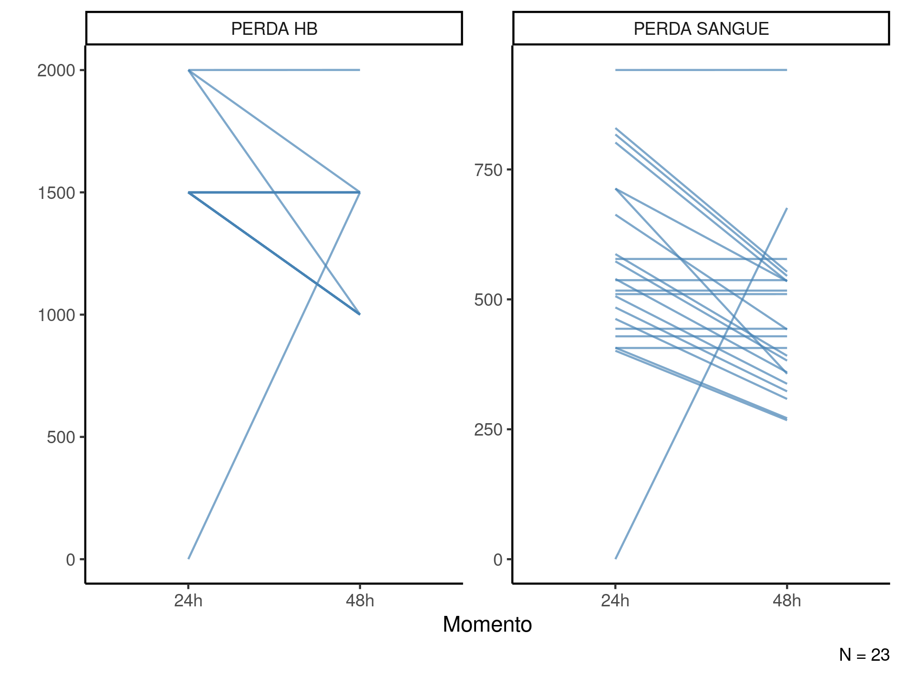

---

\newpage

**Prognóstico de componentes hematológicos após ATQ bilateral simultânea em centro cirúrgico de referência**

**Histórico do documento**

|Versão |Alterações     |
|:------|:--------------|
|01     |Versão inicial |

---

# Lista de abreviaturas

# Contexto

## Objetivos

Avaliar a perda sanguínea, de componentes hematológicos e diferença em resultados funcionais em pacientes submetidos a artroplastia total do quadril bilateral simultânea, assim como as necessidades transfusionais nesses pacientes em três momentos pós-cirúrgicos.

## Recepção e tratamento dos dados

# Metodologia

## Parâmetros do estudo

### Desenho do estudo

### Critérios de inclusão e exclusão

### Exposições

### Desfechos

### Covariáveis

## Análises Estatísticas

Esta análise foi realizada utilizando-se o software `R` versão 4.1.3.

# Resultados

## População do estudo e acompanhamento

Ao todo foram incluídos 23 participantes no estudo dos quais
15 (65%)
eram homens.
Os participantes tinham idade média (DP)
46 (11) anos,
com distribuição entre
24 e 62 anos.
A tabela 1 exibe as características clínicas e epidemiológicas dos participantes.

Table: **Tabela 1** Características epidemiológicas e clínicas dos participantes do estudo.

|                 **Características**                 |  **N = 23**   |
|:---------------------------------------------------:|:-------------:|
|                   __Sexo, n (%)__                   |               |
|                          H                          |   15 (65%)    |
|                          M                          |    8 (35%)    |
|       __Idade (anos), Média (Desvio Padrão)__       |    46 (11)    |
|       __IMC (kg/m²), Média (Desvio Padrão)__        |  28.0 (4.0)   |
|       __Volemia (L), Média (Desvio Padrão)__        |    49 (14)    |
|    __Hemoglobina pré-op, Média (Desvio Padrão)__    | 14.04 (1.54)  |
|   __Hematócritos pré-op, Média (Desvio Padrão)__    |  41.7 (4.6)   |
|                __EVA pré-op, n (%)__                |               |
|                          6                          |    3 (13%)    |
|                          7                          |   12 (52%)    |
|                          8                          |    7 (30%)    |
|                          9                          |   1 (4.3%)    |
|           __HHS, Média (Desvio Padrão)__            |  30.0 (4.1)   |
|                   __CHA, n (%)__                    |   1 (4.3%)    |
|          __Primeiro lado operado, n (%)__           |               |
|                          D                          |   12 (52%)    |
|                          E                          |   11 (48%)    |
|           __Volume transfundido, n (%)__            |               |
|                        1000                         |   2 (8.7%)    |
|                        1500                         |    6 (26%)    |
|                        2000                         |    9 (39%)    |
|                        2500                         |    5 (22%)    |
|                        3000                         |   1 (4.3%)    |
|          __Tempo até alta (dias), n (%)__           |               |
|                          2                          |    4 (17%)    |
|                          3                          |   16 (70%)    |
|                          4                          |   2 (8.7%)    |
|                         10                          |   1 (4.3%)    |
| __Perda de hemoglobina 24h, Média (Desvio Padrão)__ |  1,651 (408)  |
|   __Perda sanguínea 24h, Média (Desvio Padrão)__    | 5,702 (2,075) |
| __Perda de hemoglobina 48h, Média (Desvio Padrão)__ |  1,454 (332)  |
|   __Perda sanguínea 48h, Média (Desvio Padrão)__    | 5,055 (1,774) |

Entre 24h e 48h após a cirurgia boa parte dos participantes apresentou redução tanto na perda de hemoglobina como na perda de sangue (Tabela 1, Figura 1).
Após 24h os participantes apresentaram perda de hemoglobina em torno de 1.651 em média, e após 48h esta perda se reduziu para 1.454.
A perda de sangue média um dia após a cirurgia foi de 5.702, reduzida para 5.055 no segundo dia.

**Figura 1** Prognóstico de perda de hemoglobina (HB) e perda de sangue dos participantes nos períodos de observação.

## Prognóstico de componentes hematológicos

Os participantes do estudo tiveram redução dos parâmetros hematológicos ao longo do período de observação e aumento no escore funcional durante o período de observação (Figura 2, Tabela 2).
A hemoglobina teve redução de 3 no primeiro dia (p<0.001) e de 4.3 no segundo dia (p<0.001).
Os hematócritos teve derução de 9.4 no primeiro dia (p<0.001) e de 13 no segundo dia (p<0.001).
A dor, mensurada pela EVA teve redução de 4.6 pontos (p<0.001) e no segundo dia redução de 6.4 pontos (p<0.001).
Seis semanas após a cirurgia o HHS aumentou em média 53 pontos (p<0.001).

**Figura 2** Prognóstico das alterações nos componentes hematológicos e Harris Hip Score (HHS) dos participantes do estudo.

Table: **Tabela 2** Prognóstico das alterações nos componentes hematológicos e Harris Hip Score (HHS) dos participantes do estudo.

|**Características**                     | **pre**, N = 23 | **pos**, N = 23 | **Diferença** | **95% IC** | **Valor p** |
|:---------------------------------------|:---------------:|:---------------:|:-------------:|:----------:|:-----------:|
|Hemoglobina 24h, Média (Desvio Padrão)  |  14.04 (1.54)   |  11.03 (1.43)   |      3.0      | 2.2 to 3.8 |   <0.001    |
|Hematócritos 24h, Média (Desvio Padrão) |   41.7 (4.6)    |   32.3 (4.3)    |      9.4      | 7.0 to 12  |   <0.001    |
|EVA 24h, Média (Desvio Padrão)          |   7.26 (0.75)   |   2.70 (1.66)   |      4.6      | 3.7 to 5.4 |   <0.001    |
|Hemoglobina 48h, Média (Desvio Padrão)  |  14.04 (1.54)   |   9.74 (1.39)   |      4.3      | 3.5 to 5.1 |   <0.001    |
|Hematócritos 48h, Média (Desvio Padrão) |     42 (5)      |     29 (4)      |      13       |  11 to 15  |   <0.001    |
|EVA 48h, Média (Desvio Padrão)          |   7.26 (0.75)   |   0.83 (1.30)   |      6.4      | 5.8 to 7.1 |   <0.001    |
|HHS, Média (Desvio Padrão)              |     30 (4)      |     83 (8)      |      -53      | -57 to -49 |   <0.001    |

# Observações e limitações

# Conclusões

# Referências

- **SAP-2022-014-MM-v01** -- Plano Analítico para Prognóstico de componentes hematológicos após ATQ bilateral simultânea em centro cirúrgico de referência

# Apêndice

## Análise exploratória de dados

**Figura A1** Distribuição da idade na população do estudo.

## Disponibilidade

Todos os documentos gerados nessa consultoria foram incluídos no portfólio do consultor.

<!-- O cliente solicitou que esta análise seja mantida confidencial até uma futura data, determinada pelo próprio cliente. -->
<!-- Todos os documentos gerados nessa consultoria portanto não foram publicados online e apenas o título e o ano da análise foram incluídas no portfólio do consultor. -->
<!-- Após a data acordada, os documentos serão disponibilizados. -->

<!-- O cliente solicitou que esta análise seja mantida confidencial. -->
<!-- Todos os documentos gerados nessa consultoria portanto não foram publicados online e apenas o título e o ano da análise foram incluídas no portfólio do consultor. -->

O portfólio pode ser visto em:

<https://philsf-biostat.github.io/SAR-2022-014-MM/>

## Dados utilizados

A tabela A1 mostra a estrutura  da tabela de dados analíticos.

| id  | hb_pre | ht_pre | eva_pre | hhs_pre | cha_pre | hb_24 | ht_24 | cha_24 | vol_24 | eva_24 | perdahb_24 | perdasang_24 | hb_48 | ht_48 | cha_48 | vol_48 | eva_48 | perdahb_48 | perdasang_48 | hhs_6s |
|:---:|:------:|:------:|:-------:|:-------:|:-------:|:-----:|:-----:|:------:|:------:|:------:|:----------:|:------------:|:-----:|:-----:|:------:|:------:|:------:|:----------:|:------------:|:------:|
|  1  |        |        |         |         |         |       |       |        |        |        |            |              |       |       |        |        |        |            |              |        |
|  2  |        |        |         |         |         |       |       |        |        |        |            |              |       |       |        |        |        |            |              |        |
|  3  |        |        |         |         |         |       |       |        |        |        |            |              |       |       |        |        |        |            |              |        |
| ... |        |        |         |         |         |       |       |        |        |        |            |              |       |       |        |        |        |            |              |        |
|  N  |        |        |         |         |         |       |       |        |        |        |            |              |       |       |        |        |        |            |              |        |

Table: **Tabela A1** Estrutura da tabela de dados analíticos

Os dados utilizados neste relatório não podem ser publicados online por questões de sigilo.
